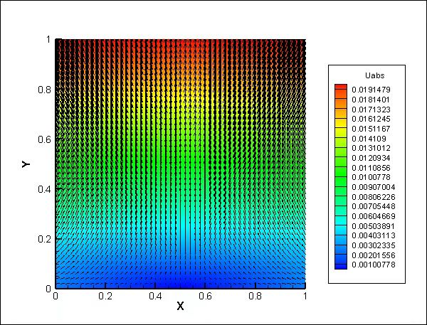

# hmsolver使用说明（一）二维平面板有限元模拟

必须确保电脑安装有 `numpy` 及其他科学计算包，推荐使用 Anaconda 来进行包的管理。其次，安装本软件包 `hmsolver`（如果没有的话）。注意，以下内容建议使用 `jupyter` 来边读边写。

```python
!pip install hmsolver
```

安装完成之后，开始对着问题写代码就好了。

## 问题描述

这里需要解决的问题是，现有一块尺寸为 1m x 1m 的平面板，平面板材料的杨氏模量是 300GPa，泊松比为 0.25。其底边中点固定（固支），底边不发生 y 方向位移，顶边设置 y 方向位移边界条件 v = 0.02m。求整个平面板的位移场，应力应变场。

## 问题求解

下面展示 `hmsolver` 如何求解二维平面板问题。首先我们需要引入最核心的计算包 `numpy` 以方便之后的处理。

```python
import numpy as np
```

对于这类模拟问题，我们需要的信息有三大类：几何网格信息，材料性质信息和边界条件。所以我们逐一定义这三种信息，来创建一个模拟问题实例。

对于几何网格信息，我们需要预先定义整个问题的求解区域，再对区域进行网格剖分。在这里二维问题使用 `Zone2d` 类型进行包装。

```python
from hmsolver.meshgrid.zone2d import Zone2d

zone_xl, zone_xr = 0, 1
zone_yl, zone_yr = 0, 1
zone_xmid = 0.5 * (zone_xl + zone_xr)
zone_ymid = 0.5 * (zone_yl + zone_yr)
zone = Zone2d(zone_xl, zone_xr, zone_yl, zone_yr)
```

定义好变量 `zone` 之后，我们对区域进行网格剖分。网格剖分时需要我们指定返回的类型，这里使用的是 `Mesh2d` 类型。


```python
from hmsolver.meshgrid.mesh2d import Mesh2d

grid_size = 0.02
mesh2d = zone.meshgrid_zone(Mesh2d, grid_size)
```

这样我们所需的几何网络信息已经准备就绪了。
下面处理材料信息，由于是基础的连续介质力学问题，这里只要提供杨氏模量和泊松比就可以定义材料了。材料使用 `Material2d` 类型进行包装。

```python
from hmsolver.material.material2d import Material2d

material2d = Material2d(3e11, 0.25)
```

最后来处理我们的边界条件，边界条件涉及到的信息有类型，所施加的边界，和所施加的值。每一个独立的边界条件用 `Boundary_Cond` 类型封装，而每一个问题所对应的边界条件集合用 `BoundaryConds2d` 类型封装。由于 `BoundaryConds2d` 继承于 python 的列表类（list），所以更加方便我们添加边界条件。对于这个问题，他总共用到了 3 条边界条件，我们逐一声明即可。

```python
from hmsolver.femcore.treat_boundary import point_criteria, segment_criteria
from hmsolver.femcore.treat_boundary import boundary_cond2d, BoundaryConds2d

tension = 0.02
boundary_0 = point_criteria(zone_xmid, zone_yl)
boundary_1 = segment_criteria(zone_xl, zone_yl, zone_xr, zone_yl)
boundary_2 = segment_criteria(zone_xl, zone_yr, zone_xr, zone_yr)

_bc_ = boundary_cond2d  # abbreviate the word for type & read
boundarys = BoundaryConds2d(
    _bc_("point", boundary_0, "fixed", None, None),
    _bc_("segment", boundary_1, "set_uy", "constant", 0),
    _bc_("segment", boundary_2, "set_uy", "constant", tension),
)
del _bc_  # delete the abbreviation
boundarys.manually_verify()
```

在这里，我们需先定义三条边界的判断条件，然后再用函数 `boundary_cond2d` 生成我们的真正的边界条件。例如 `bondary_1` 对应的是底边的判断条件，由于底边不发生 y 方向的位移，所以设置 `set_uy` 为常数 `constant`，值为 0。最后把这些统统打包到 `boundarys` 当中，就大功告成了。
当我们的信息准备周全之后，就可以把这些都整理到真正的模拟问题 `Simulation2d` 当中。最后我们需要人工调用方法 `manually_verify()` 对边界条件进行人工确认。当然，你可以使用 `manually_halt()` 来人工取消认可。

```python
from hmsolver.app.simulation2d import Simulation2d

app = Simulation2d(mesh2d, material2d, boundarys)
app.app_name = "plate"
```

在创建 `Simulation2d` 类型的变量时，会自动的对其进行类型检查，比如我现在创建一个缺少材料信息的模拟实例。

```python
app2 = Simulation2d(mesh2d, None, boundarys)
```

```plain
Material instance type ERROR.
SHOULD BE Material2d object/subclass object.
```

注意到这里输出了错误提示，但凡出现错误提示的时候，整个实例是无法正确运行的。为了检查当前实例是否类型准确，可以人工调用方法 `type_check()` 进行检查。

```python
print(app.type_check())
```

```python
True
```

问题虽然完整定义了，但是却不代表模拟可以正确执行了。注意到如果想要开始模拟，还需要认为指定与网格相匹配的有限元单元，否则虽然一硝二硫三木炭凑齐了，但是没有雷管还是炸不起来。不信可以调用方法 `check_engine()` 来看看。

```python
app.check_engine()
```

```plain
********************************
Simulation Manual Checking:
Mesh is ready.
Material is ready.
Boundary Conds is ready.
Basis is NOT ready.
Failed.
********************************
```

在这里，我们使用平面的四边形等参一阶单元，这个单元的所有功能已经被封装到 `hmsolver.basis.quad4.Quad4Node` 当中，我们所需要做的就是将它应用到我们的模拟实例上，然后再检查一遍是否可以计算即可。

```python
from hmsolver.basis.quad4 import Quad4Node

app.apply_basis(Quad4Node())
app.check_engine()
```

```plain
********************************
Simulation Manual Checking:
Mesh is ready.
Material is ready.
Boundary Conds is ready.
Basis is ready.
OK.
********************************
```

输出 OK，一切就绪。
目前模拟可以输出 5 种有价值的模拟结果数据，这里可以通过 `provied_solutions` 属性进行查阅。

```python
app.provied_solutions
```

```python
['displace_field',
 'absolute_displace',
 'strain_field',
 'stress_field',
 'distortion_energy']
```

这 5 种数据的意义及调用方式如下

|    数据    |         属性名          |   属性缩写    |
| :--------: | :---------------------: | :-----------: |
|    位移    |  `app.displace_field`   |    `app.u`    |
| 位移绝对值 |    `app.absolute_u`     |  `app.u_abs`  |
|    应变    |   `app.strain_field`    | `app.epsilon` |
|    应力    |   `app.stress_field`    |  `app.sigma`  |
|   畸变能   | `app.distortion_energy` |  `app.w_dis`  |

当然，你也可以全部计算，并且打包到 tecplot 数据文件当中来进行可视化。

```python
app.export_to_tecplot("elasticity", *app.provied_solutions)
```

```plain
        build stiffness martix k0 processing 17%, working on 426/2500, eta 0h 0min 8.66s
        build stiffness martix k0 processing 34%, working on 851/2500, eta 0h 0min 7.06s
        build stiffness martix k0 processing 51%, working on 1276/2500, eta 0h 0min 5.24s
        build stiffness martix k0 processing 68%, working on 1701/2500, eta 0h 0min 3.37s
        build stiffness martix k0 processing 85%, working on 2126/2500, eta 0h 0min 1.58s
        generating completed. Total 0h 0min 10.51s
        mapping stiffness martix processing 17%, working on 426/2500, eta 0h 0min 0.19s
        mapping stiffness martix processing 34%, working on 851/2500, eta 0h 0min 0.13s
        mapping stiffness martix processing 51%, working on 1276/2500, eta 0h 0min 0.09s
        mapping stiffness martix processing 68%, working on 1701/2500, eta 0h 0min 0.06s
        mapping stiffness martix processing 85%, working on 2126/2500, eta 0h 0min 0.03s
        assembling completed. Total 0h 0min 0.18s
get_absolute_displace done.
get_strain_field done.
get_stress_field done.
get_distortion_energy done.
```

至此，你会发现运行目录多了两个文件 `ESM-2500-elements.bin` 和 `plate-elasticity.dat`。前者为数据文件，储存了当前网格下的单元的刚度矩阵。后者为 tecplot 数据文件，记录了之前我们所想要的所有信息（位移场、位移绝对值、应力应变场、畸变能）。

由于这个算例是一个简单的水平拉伸问题，所以我们只看一下位移场的结果好了。下面三图分别是 x 方向位移、y 方向位移和位移的绝对值。


